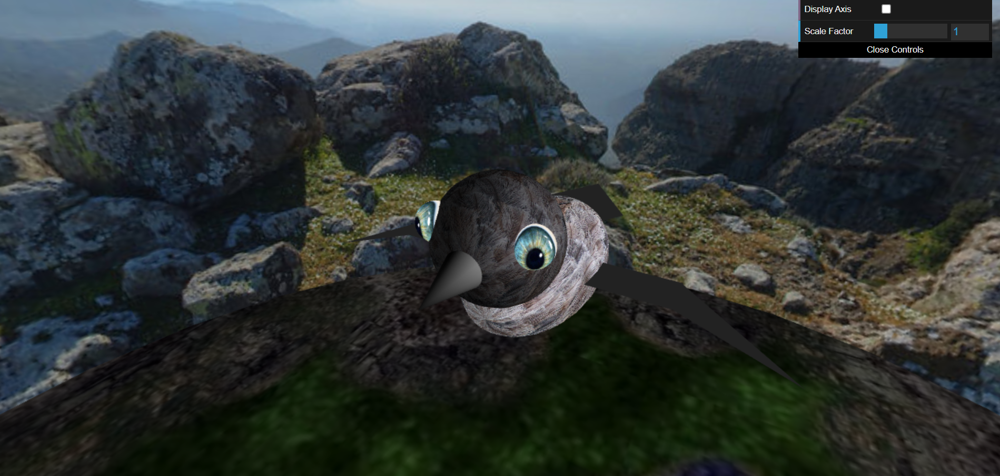
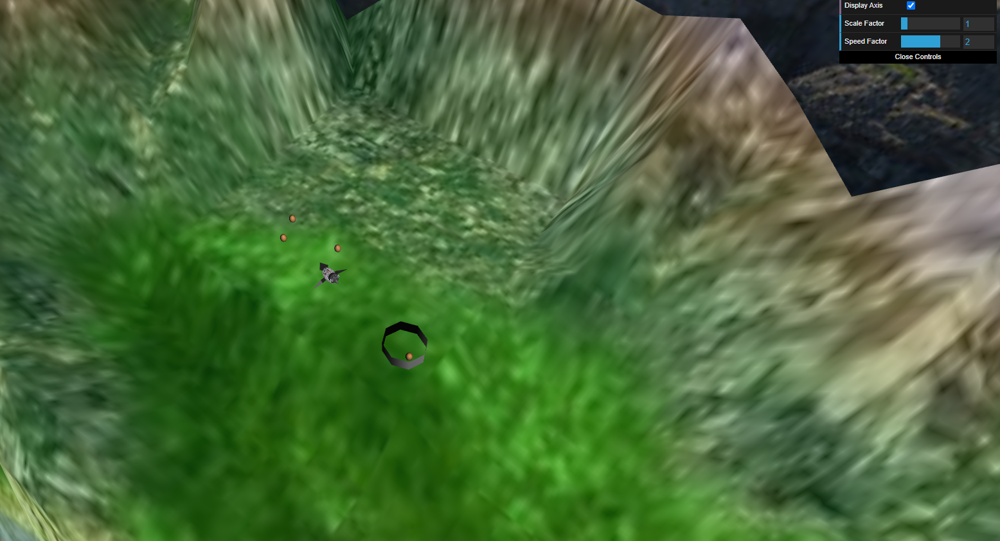
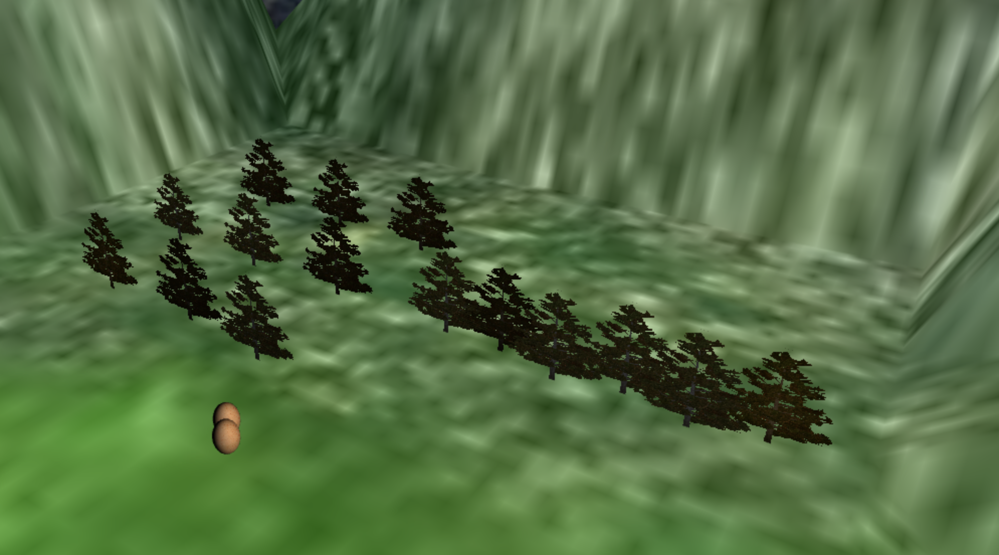

# CG 2022/2023

## Group T05G02
| Name             | Number    | E-Mail             |
| ---------------- | --------- | ------------------ |
| Rafael Alves        | 202004476 | up202004476@edu.fc.up.pt|
| Rafael Cerqueira         | 201910200 | up201910200@up.pt |

## Project Notes

- In Sphere Creation part we had no difficulties.

- In the Creation of Panoramas part we had difficulties making it visible from the inside and not from the outside.

Creation of Panoramas - two perspectives of the scene and panorama.

- In the Inclusion of a Bird part we had no difficulties making in the Bird modeling and the Bird Control, but had some difficulties in the Bird animation doing the second animation for wing flapping.

Inclusion of a Bird - What the bird looks like

- In the Terrain part we had no difficulties

Terrain

- In the Eggs and Nest part we had some difficulties making the bird to go down to catch the eggs.

Eggs and Nest with an egg already catched and dropped

- In the Tree part we couldn't make the trees rotate in the direction of the camera

Tree Group and Tree Row

- We didn't make any additional developments.
