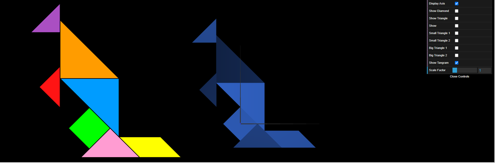
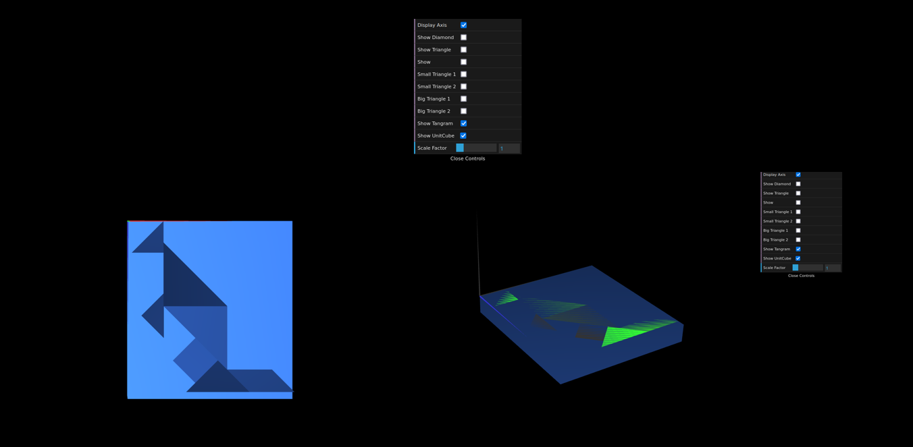
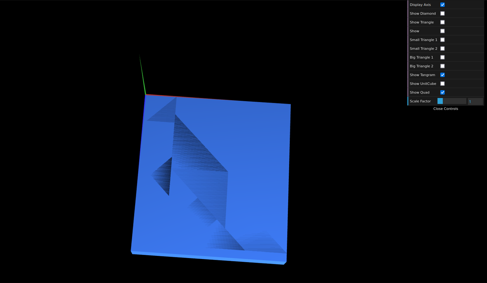

# CG 2022/2023

## Group T05G02

## TP 2 Notes

- In exercise 1 we had difficulties in making the rotations and translations necessary to make the tangram, but we overcame them.

- In exercise 2 we had difficulties getting the screenshots.

- In exercise 3 we had difficulties transforming the quad into a cube.

Tangram

Three-dimensional geometry - Unit Cube

Composite Geometry - Cube composed of Planes

