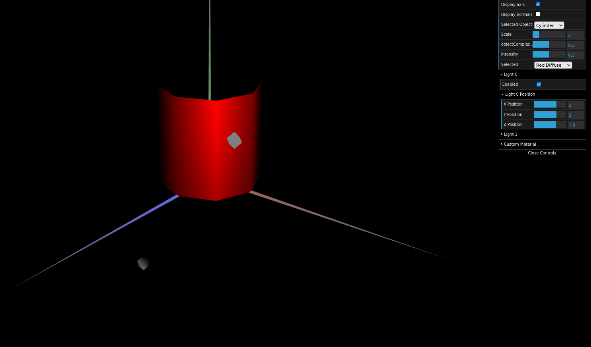

# CG 2022/2023

## Group T05G02

## TP 3 Notes

- In exercise 1, 2, 4 and 6 we didn't have difficulties.

- In exercise 3 we had difficulties understanding the order in the code to apply the normals.

- In exercise 5 we had difficulties converting the RGB colors.

Wood like material

'Custom' material apllied to the Tangram piece represented by MyDiamond

- In the second part of the TP3, in constant shading the normal is calculated in 1 point and applicated in the whole face, and in this exercise we calculated 1 normal and applicated to all of the vertices of the face.

Prism with 20 stacks and 6 slices

Cylinder with 20 stacks and 8 slices

